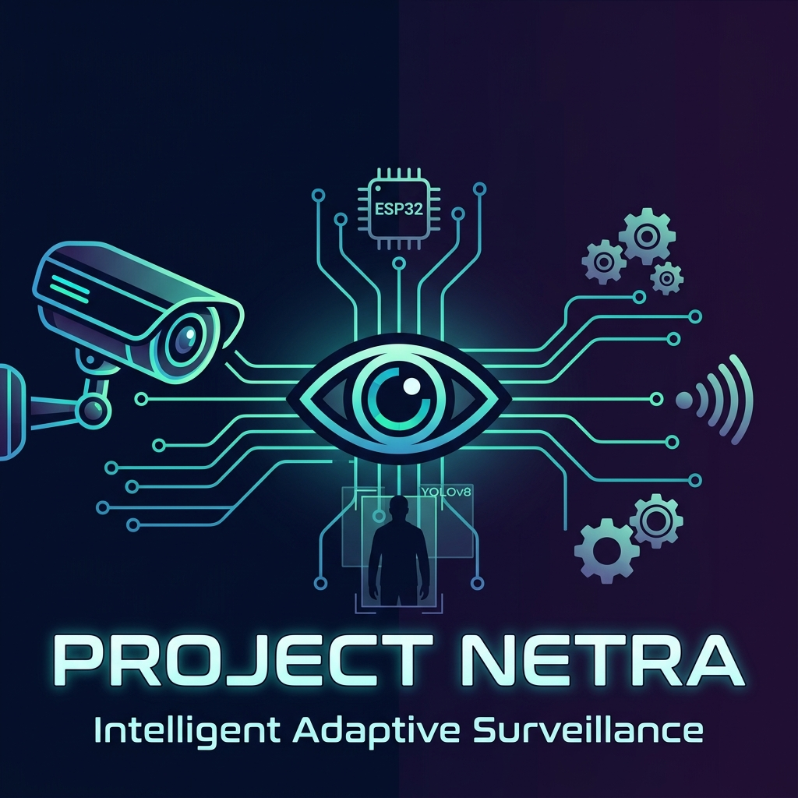

<p align="center">
  
</p>

<h1 align="center">
  🛡️ Project Netra — Intelligent Adaptive Surveillance
</h1>

<p align="center">
  <em>An AI-powered, ESP32-based real-time surveillance system with YOLOv8 person tracking, pan-tilt servo control, and a live React dashboard.</em>
</p>

<p align="center">
  
  
  
  
  
</p>

---

## 📑 Table of Contents

- [Overview](#-overview)
- [Features](#-features)
- [System Architecture](#-system-architecture)
- [Tech Stack](#-tech-stack)
- [Hardware Requirements](#-hardware-requirements)
- [Wiring Diagram](#-wiring-diagram)
- [Project Structure](#-project-structure)
- [Setup Guide](#-setup-guide)
  - [1. Hardware Assembly](#1-hardware-assembly)
  - [2. Firmware Upload](#2-firmware-upload-esp32)
  - [3. Backend Setup](#3-backend-setup-python)
  - [4. Dashboard Setup](#4-dashboard-setup-react)
  - [5. MQTT Broker](#5-mqtt-broker-mosquitto)
  - [6. Launch Everything](#6-launch-everything)
- [Usage](#-usage)
- [API Reference](#-api-reference)
- [MQTT Topics](#-mqtt-topics)
- [Troubleshooting](#-troubleshooting)
- [Contributing](#-contributing)
- [License](#-license)

---

## 🌟 Overview

**Project Netra** (*Netra = "Eye" in Sanskrit*) is a complete, end-to-end intelligent surveillance system built for a Microprocessors & Microcontrollers (MPMC) course project. It combines embedded systems (ESP32-CAM), computer vision (YOLOv8), and modern web technologies into a real-time security monitoring platform.

The system streams live video from an ESP32-CAM, processes frames through YOLOv8 for person detection, and **automatically adjusts pan-tilt servos to track and follow a detected person** — all controllable from a sleek React dashboard.

### 🎬 Demo

| Live Camera Feed | YOLO Auto-Tracking | Dashboard UI |
|:---:|:---:|:---:|
| MJPEG stream at ~15 FPS | Camera follows person | Real-time controls |
| 640×480 VGA resolution | Proportional servo control | Alerts & anomaly scoring |

---

## ✨ Features

### 🎥 Camera & Streaming
- **MJPEG Video Streaming** — Real-time HTTP stream from ESP32-CAM at 640×480 VGA
- **Dual-Buffer Capture** — PSRAM-backed frame buffers for smooth streaming
- **Auto-Reconnect** — Dashboard automatically recovers from stream drops within 4 seconds

### 🤖 AI-Powered Detection & Tracking
- **YOLOv8 Nano** — Real-time object detection (persons, vehicles, animals, etc.)
- **Auto-Tracking Mode** — Camera servos automatically follow detected person
- **Proportional Control** — Servo speed adjusts based on target's distance from frame center
- **Dead Zone** — 12% center tolerance to prevent servo jitter
- **Anomaly Scoring** — Pattern-based threat assessment with configurable thresholds

### 🕹️ Pan-Tilt Servo Control
- **Manual Mode** — Joystick-style directional controls from dashboard
- **Auto Mode** — YOLO-driven autonomous person tracking
- **Patrol Mode** — Pre-defined waypoint patrol patterns
- **MG90S Metal Gear Servos** — 0°–180° pan, 30°–150° tilt range

### 📡 Communication
- **MQTT Protocol** — Lightweight pub/sub messaging between all components
- **WebSocket** — Real-time push updates to the dashboard
- **ESP-NOW Mesh** — Multi-camera handoff support (scalable to 8 nodes)

### 📊 Dashboard
- **Live Feed** — Stream-isolated rendering (React re-renders don't break the feed)
- **Camera Controls** — Manual joystick, Auto tracking, and Adaptive modes
- **Alert Center** — Real-time threat alerts with severity levels
- **System Status** — WebSocket, MQTT, and camera health monitoring
- **Settings** — Runtime IP configuration for Camera and Servo ESP32s

---

## 🏗️ System Architecture

```
┌─────────────────────────────────────────────────────────────────────┐
│                        PROJECT NETRA ARCHITECTURE                   │
├─────────────────────────────────────────────────────────────────────┤
│                                                                     │
│   ┌──────────────┐         MQTT          ┌──────────────────────┐  │
│   │  ESP32-CAM   │◄────────────────────► │   FastAPI Backend    │  │
│   │              │    netra/cam01/#       │                      │  │
│   │  • Camera    │                       │  • YOLOv8 Engine     │  │
│   │  • Stream    │   HTTP :81/stream     │  • Auto-Tracker      │  │
│   │  • Servos    │──────────────────────►│  • Object Tracker    │  │
│   │  • PIR       │                       │  • Anomaly Engine    │  │
│   │  • Edge Det  │                       │  • Patrol Optimizer  │  │
│   └──────────────┘                       │  • MQTT Bridge       │  │
│                                          └──────────┬───────────┘  │
│   ┌──────────────┐                                  │              │
│   │  ESP32       │                           WebSocket API         │
│   │  DevKit      │                                  │              │
│   │              │                       ┌──────────▼───────────┐  │
│   │  • Servo     │   HTTP :81/servo      │   React Dashboard    │  │
│   │    Control   │◄──────────────────────│                      │  │
│   │  • MQTT      │                       │  • Live Feed         │  │
│   └──────────────┘                       │  • Camera Controls   │  │
│                                          │  • Alert Center      │  │
│   ┌──────────────┐                       │  • System Status     │  │
│   │  Mosquitto   │                       │  • Heat Map          │  │
│   │  MQTT Broker │◄─────────────────────►│  • Digital Twin Map  │  │
│   │  :1883       │                       └──────────────────────┘  │
│   └──────────────┘                                                 │
└─────────────────────────────────────────────────────────────────────┘
```

---

## 🛠️ Tech Stack

| Layer | Technology | Purpose |
|-------|-----------|---------|
| **Firmware** | Arduino (ESP32) | Camera streaming, servo control, edge detection |
| **Backend** | FastAPI (Python 3.10+) | API, YOLO inference, MQTT bridge, tracking |
| **Frontend** | React 18 + Vite | Live dashboard, controls, visualization |
| **AI Model** | YOLOv8 Nano (Ultralytics) | Person/object detection |
| **Messaging** | MQTT (Mosquitto) | Device-to-server communication |
| **Database** | SQLite + SQLAlchemy | Alert history, configurations |
| **Streaming** | MJPEG over HTTP | Live video feed |

---

## 🔧 Hardware Requirements

| Component | Specification | Qty | Purpose |
|-----------|--------------|:---:|---------|
| ESP32-CAM (AI-Thinker) | OV2640 camera, PSRAM | 1 | Video streaming |
| ESP32 DevKit V1 | 38-pin | 1 | Servo controller |
| MG90S Servo Motor | Metal gear, 180° | 2 | Pan and Tilt |
| MB102 Breadboard PSU | 3.3V / 5V output | 1 | Power regulation |
| Breadboard | Full-size 830pt | 1 | Prototyping |
| Jumper Wires | M-M, M-F | ~20 | Connections |
| USB Cable | Micro-USB | 2 | Programming + power |
| Power Adapter | **5V 2A** (recommended) | 1 | External power |

> [!WARNING]
> **Power Supply:** The MB102 breadboard PSU regulator is limited to ~700mA. Do **NOT** power servos through the MB102 regulator — they draw 300-500mA each under load. Use a **5V 2A USB charger** connected directly to the breadboard power rails for servo power, with a **shared GND** between the MB102 and the charger.

---

## 🔌 Wiring Diagram

### ESP32-CAM (Camera Node)
```
ESP32-CAM AI-Thinker
├── OV2640 Camera ─── Built-in (no wiring needed)
├── GPIO 18 ─────────── Pan Servo Signal (Orange)
├── GPIO 19 ─────────── Tilt Servo Signal (Orange)
├── GPIO 13 ─────────── PIR Sensor OUT (optional)
├── GPIO 33 ─────────── Status LED (built-in)
├── GPIO 4  ─────────── Flash LED (built-in)
├── 5V ──────────────── Servo VCC (Red) + MB102 5V
└── GND ─────────────── Servo GND (Brown) + MB102 GND
```

### ESP32 DevKit (Servo Controller)
```
ESP32 DevKit V1
├── GPIO 18 ─────────── Pan Servo Signal (Orange)
├── GPIO 19 ─────────── Tilt Servo Signal (Orange)
├── 5V ──────────────── Servo VCC (Red)
└── GND ─────────────── Servo GND (Brown)
```

### Power Distribution
```
5V 2A USB Adapter
├── Breadboard Power Rail (+) ─── Servo VCC (both servos)
├── Breadboard Power Rail (-) ─── Servo GND + ESP32 GND
└── MB102 module powers ESP32s via 3.3V/5V pins
```

---

## 📁 Project Structure

```
MPMC Project/
├── 📁 firmware/                    # ESP32 firmware (Arduino/PlatformIO)
│   ├── 📁 main/
│   │   ├── main.ino               # Main firmware entry point
│   │   ├── config.h               # WiFi, MQTT, servo, camera config
│   │   ├── camera_stream.h        # MJPEG streaming engine
│   │   ├── servo_control.h        # Pan/tilt servo driver
│   │   ├── mqtt_handler.h         # MQTT pub/sub handler
│   │   ├── edge_detect.h          # On-device motion detection
│   │   └── mesh_comm.h            # ESP-NOW mesh communication
│   └── platformio.ini             # PlatformIO build configuration
│
├── 📁 backend/                     # FastAPI backend server
│   ├── 📁 app/
│   │   ├── main.py                # FastAPI app + startup lifecycle
│   │   ├── 📁 routers/
│   │   │   ├── camera.py          # Camera, servo, tracking, streaming APIs
│   │   │   ├── detection.py       # YOLO detection endpoints
│   │   │   ├── alerts.py          # Alert management endpoints
│   │   │   └── patrol.py          # Patrol & heatmap endpoints
│   │   ├── 📁 services/
│   │   │   ├── yolo_engine.py     # YOLOv8 inference engine
│   │   │   ├── auto_tracker.py    # YOLO-powered auto person tracking
│   │   │   ├── tracker.py         # Multi-object tracker (Kalman + Hungarian)
│   │   │   ├── anomaly.py         # Anomaly scoring engine
│   │   │   ├── patrol_optimizer.py# Patrol route optimizer
│   │   │   └── mqtt_bridge.py     # MQTT ↔ FastAPI bridge
│   │   ├── 📁 models/
│   │   │   └── schemas.py         # Pydantic data models
│   │   └── 📁 database/
│   │       └── db.py              # SQLite database setup
│   ├── requirements.txt           # Python dependencies
│   └── yolov8n.pt                 # YOLOv8 Nano model weights
│
├── 📁 dashboard/                   # React frontend dashboard
│   ├── 📁 src/
│   │   ├── App.jsx                # Main application component
│   │   ├── main.jsx               # React entry point
│   │   └── 📁 styles/
│   │       └── index.css          # Complete design system (dark theme)
│   ├── index.html                 # HTML entry
│   ├── package.json               # npm dependencies
│   └── vite.config.js             # Vite build config
│
├── 📁 assets/                      # Repository assets
│   └── banner.png                 # README banner
├── mosquitto.conf                 # MQTT broker configuration
└── README.md                      # This file
```

---

## 🚀 Setup Guide

### Prerequisites

| Software | Version | Download |
|----------|---------|----------|
| Python | 3.10+ | [python.org](https://www.python.org/downloads/) |
| Node.js | 18+ | [nodejs.org](https://nodejs.org/) |
| Arduino IDE / PlatformIO | Latest | [arduino.cc](https://www.arduino.cc/en/software) |
| Mosquitto MQTT | 2.0+ | [mosquitto.org](https://mosquitto.org/download/) |
| Git | Latest | [git-scm.com](https://git-scm.com/) |

---

### 1. Hardware Assembly

1. **Mount the ESP32-CAM** on the pan-tilt servo bracket
2. **Connect servos** to ESP32 DevKit:
   - Pan servo signal → GPIO 18
   - Tilt servo signal → GPIO 19
   - Servo VCC → 5V power rail (NOT through MB102 regulator)
   - Servo GND → Common ground
3. **Power supply:**
   - Use a **5V 2A** adapter for servos (direct to breadboard rails)
   - Power ESP32s through MB102 or USB
   - **Ensure common GND** between all power sources

> [!CAUTION]
> Never power MG90S servos through the MB102 3.3V output — they require 5V and draw too much current for the regulator.

---

### 2. Firmware Upload (ESP32)

```bash
# Clone the repository
git clone https://github.com/yourusername/Netra.git
cd Netra
```

#### Configure WiFi & MQTT

Edit `firmware/main/config.h`:

```c
#define WIFI_SSID       "YourWiFiName"
#define WIFI_PASSWORD   "YourWiFiPassword"
#define MQTT_BROKER     "YOUR_PC_IP"     // Run `ipconfig` on your PC
#define MQTT_PORT       1883
```

#### Upload via Arduino IDE

1. Open `firmware/main/main.ino` in Arduino IDE
2. Install board: **ESP32 by Espressif** (Board Manager)
3. Install libraries:
   - `ESP32Servo` by Kevin Harrington
   - `PubSubClient` by Nick O'Leary
   - `ArduinoJson` by Benoît Blanchon
4. Select board: **AI Thinker ESP32-CAM**
5. Select correct COM port
6. Upload (hold BOOT button during upload if needed)

#### Upload via PlatformIO (Alternative)

```bash
cd firmware
pio run -t upload --upload-port COM3
pio device monitor --baud 115200
```

After upload, the serial monitor should show:
```
[NETRA] Project Netra — Intelligent Adaptive Surveillance
[CAM]   PSRAM found — VGA 640x480, dual buffer
[CAM]   Camera initialized!
[WIFI]  Connected! IP: 192.168.x.x
[STREAM] Stream: http://192.168.x.x:81/stream
[MQTT]  Connected to broker
```

> [!NOTE]
> Note the IP address shown — you'll need it for the dashboard configuration.

---

### 3. Backend Setup (Python)

```bash
cd backend

# Create virtual environment
python -m venv venv

# Activate it
# Windows:
venv\Scripts\activate
# Linux/Mac:
source venv/bin/activate

# Install dependencies
pip install -r requirements.txt
```

#### Configure Default IPs

Edit `backend/app/main.py` and update the default IPs in the `AppState` class:

```python
class AppState:
    camera_ip: str = "YOUR_ESP32_CAM_IP"    # From serial monitor
    servo_ip: str  = "YOUR_ESP32_DEVKIT_IP" # From serial monitor
```

---

### 4. Dashboard Setup (React)

```bash
cd dashboard
npm install
```

The Vite proxy is pre-configured to forward API calls to the backend on port 8000.

---

### 5. MQTT Broker (Mosquitto)

#### Windows (Pre-installed)

Mosquitto is expected at `C:\Program Files\mosquitto\`. The project includes a `mosquitto.conf`:

```conf
listener 1883 0.0.0.0
allow_anonymous true
```

#### Linux / Mac

```bash
# Install
sudo apt install mosquitto mosquitto-clients  # Ubuntu/Debian
brew install mosquitto                         # macOS

# Start with config
mosquitto -c mosquitto.conf -v
```

---

### 6. Launch Everything

**Start services in this exact order:**

#### Step 1: MQTT Broker
```bash
# Windows
& "C:\Program Files\mosquitto\mosquitto.exe" -c mosquitto.conf -v

# Linux/Mac
mosquitto -c mosquitto.conf -v
```

#### Step 2: Backend API
```bash
cd backend
python -m uvicorn app.main:app --reload --host 0.0.0.0 --port 8000
```

#### Step 3: React Dashboard
```bash
cd dashboard
npm run dev
```

#### Step 4: Open Dashboard
Navigate to **http://localhost:5173** in your browser.

> [!IMPORTANT]
> **Startup order matters!** MQTT must be running before the backend starts, as the backend connects to the MQTT broker during initialization.

---

## 📖 Usage

### Manual Mode (Default)
1. Open the dashboard at `http://localhost:5173`
2. The live camera feed should appear automatically
3. Use the **▲ ▼ ◄ ►** buttons to manually control the camera pan/tilt
4. Adjust **Speed** slider (0–100%) for finer control
5. Press **⊙** to center the camera

### Auto-Tracking Mode (YOLO)
1. Click the **"Auto"** button in Camera Controls
2. The backend starts grabbing frames and running YOLOv8 detection
3. When a person is detected, the camera **automatically adjusts servos** to keep them centered
4. A **🎯 LOCKED** badge appears when a person is being tracked
5. Detection chips overlay on the feed show what YOLO detects
6. Click **"Manual"** to return to manual control

### Settings
1. Click **⚙️ Settings** in the top-right corner
2. Enter the **Camera IP** (ESP32-CAM) and **Servo IP** (ESP32 DevKit)
3. Click **Apply** to save

---

## 📡 API Reference

Base URL: `http://localhost:8000/api`

### Camera & Streaming

| Method | Endpoint | Description |
|--------|----------|-------------|
| `GET` | `/camera/list` | List all registered cameras |
| `GET` | `/camera/{id}/status` | Get camera status |
| `GET` | `/camera/{id}/stream` | Proxy MJPEG stream |
| `GET` | `/camera/{id}/snapshot` | Get single JPEG frame |
| `GET` | `/camera/config/ips` | Get configured IPs |
| `PUT` | `/camera/config/ips` | Update camera/servo IPs |

### Servo Control

| Method | Endpoint | Description |
|--------|----------|-------------|
| `POST` | `/camera/{id}/servo` | Send servo command (via MQTT) |
| `POST` | `/camera/{id}/servo/center` | Center camera position |
| `GET` | `/camera/{id}/servo-direct` | Direct HTTP servo control |

### Auto-Tracking

| Method | Endpoint | Description |
|--------|----------|-------------|
| `POST` | `/camera/tracking/start` | Start YOLO auto-tracking |
| `POST` | `/camera/tracking/stop` | Stop auto-tracking |
| `GET` | `/camera/tracking/status` | Get tracking status |

### Detection & Alerts

| Method | Endpoint | Description |
|--------|----------|-------------|
| `GET` | `/detection/stats` | YOLO engine statistics |
| `POST` | `/detection/analyze` | Analyze uploaded frame |
| `GET` | `/alerts/active` | Get active alerts |
| `GET` | `/patrol/heatmap` | Get activity heatmap data |

### WebSocket

| Endpoint | Description |
|----------|-------------|
| `ws://localhost:8000/api/camera/ws` | Real-time detection, tracking & alert updates |

---

## 📬 MQTT Topics

| Topic | Direction | Payload | Purpose |
|-------|-----------|---------|---------|
| `netra/cam01/servo/cmd` | Server → ESP32 | `{"direction":"up","value":5}` | Servo control |
| `netra/cam01/servo/status` | ESP32 → Server | `{"pan":90,"tilt":90}` | Servo position |
| `netra/cam01/status` | ESP32 → Server | `{"uptime":...,"rssi":...}` | Heartbeat |
| `netra/cam01/detection` | ESP32 → Server | `{"motion":true,"area":1200}` | Edge detection |
| `netra/cam01/patrol/cmd` | Server → ESP32 | `{"action":"start"}` | Patrol control |
| `netra/cam01/edge/config` | Server → ESP32 | `{"threshold":30}` | Edge config |
| `netra/mesh/event` | ESP32 ↔ ESP32 | `{"type":"handoff",...}` | Mesh events |

---

## 🔧 Troubleshooting

### Camera Feed Not Loading

| Symptom | Cause | Fix |
|---------|-------|-----|
| Black screen on first load | Camera IP not configured | Check Settings → enter ESP32-CAM IP |
| Feed loads after page refresh | WebSocket reconnecting | Wait 4s — auto-reconnect handles this |
| `ERR_CONNECTION_TIMED_OUT` | ESP32-CAM offline | Check power, press reset, verify WiFi |

### Stream Freezes on Servo Press

| Symptom | Cause | Fix |
|---------|-------|-----|
| Feed freezes when pressing ▲▼◄► | Both ESP32s share same power supply | Use separate 5V 2A adapter for servos |
| Feed freezes momentarily | Servo current spike → voltage drop | Add 470µF capacitor across servo power |

### MQTT Not Connecting

```bash
# Test MQTT broker is running
mosquitto_pub -h localhost -t "test" -m "hello"
mosquitto_sub -h localhost -t "test"

# Check ESP32 serial monitor for MQTT errors
# Verify MQTT_BROKER IP in config.h matches your PC's IP
```

### Backend Won't Start

```bash
# Check if port 8000 is in use
netstat -ano | findstr :8000

# Kill stale process
taskkill /PID <PID> /F

# Verify all dependencies installed
pip install -r requirements.txt
```

---

## 🤝 Contributing

Contributions are welcome! Here's how to get started:

1. **Fork** the repository
2. **Create a feature branch:** `git checkout -b feature/my-feature`
3. **Commit changes:** `git commit -m "Add my feature"`
4. **Push to branch:** `git push origin feature/my-feature`
5. **Open a Pull Request**

### Development Guidelines

- Follow existing code style and commenting patterns
- Test firmware changes on actual hardware before submitting
- Update the README if you add new features or change the setup process
- Use meaningful commit messages

---

## 📄 License

This project is licensed under the **MIT License** — see the [LICENSE](LICENSE) file for details.

---

## 👤 Author

**Divya Kush** — [@divyakush2006](https://github.com/divyakush2006)

---

<p align="center">
  <b>Built with 💡 for MPMC Course Project</b><br>
  <em>ESP32 • Python • React • YOLOv8 • MQTT</em>
</p>
